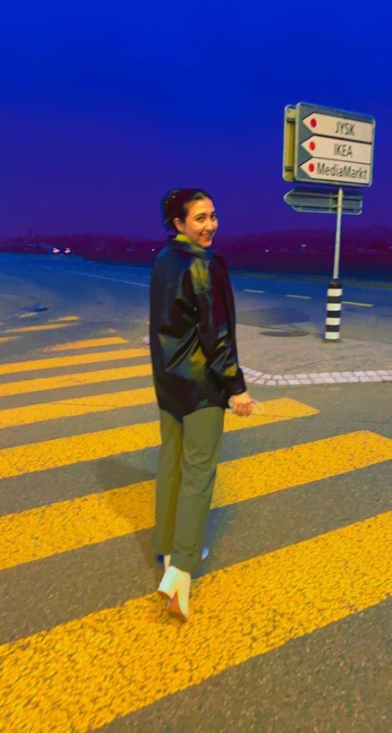

+++
title = "\"Wir konnten in 10 Tagen nur 3-mal essen\""
date = "2023-03-20"
draft = true
pinned = false
+++
# Das Leben auf der Flucht

**Morsal(22) musste aufgrund des Krieges und der Terrorherrschaft der Taliban ihr Land verlassen. Wie die Flucht verlief und welche Hürden sie bis heute bewältigen muss erzhält sie uns in diesem Interview.**

Ein Interview von **Marco Probst** und **Basil Bernard.**

*Morsal(22) flüchtete 2015 in die Schweiz.*

**Wie bist du in die Schweiz gekommen?**

**Morsal:** Der Weg dauerte einen Monat und wir sind mit allem Möglichen in die Schweiz gekommen.  Wir waren 10 Tage unterwegs von Afghanistan bis in den Iran, mit dem Auto, aber manchmal mussten wir auch zu Fuss über die Grenzen Laufen.

<!--StartFragment-->



Morsal ist am 1. Oktober 2015 mit ihrer Familie in die Schweiz gekommen. Ihre grosse Leidenschaft neben ihrem Beruf ist das Fussball spielen.  Ihr Traum ist es die Höhere Fachschule zu besuchen um etwas nützliches für die Gesellschaft zu sein.



<!--EndFragment-->

**Kannst du diesen Weg etwas ausführlicher beschreiben, was genau hast du auf deiner Flucht erlebt?**

Während diesen 10 Tagen haben wir nur 3-mal gegessen, es gab nur Brot mit Joghurt. Als wir im Iran angekommen sind mussten wir 7 Stunden über die Grenze in die Türkei laufen. Das hat 10 Stunden gedauert und ich war mit meiner ganzen Familie unterwegs. Wir liefen, bis meine Schuhe kaputt gegangen sind und ich barfuss über die Steine weiterlaufen musste. Es war unglaublich schmerzhaft, aber nicht schmerzhafter als das, was ich in Afghanistan erlebt habe. Nachdem wir in der Türkei angekommen sind, gingen wir in ein Hotel, dort waren überall fremde Männer. Ich und meine Mutter hatten wirklich Angst und es war ganz schwierig mit diesen fremden Männern. In der Nacht haben wir unsere Reise fortgesetzt und es war so, dass wir illegal das Meer von der Türkei nach Griechenland im Boot überquert haben. In Griechenland angekommen hat mein Onkel aus Afghanistan uns Geld geschickt, Gott sei Dank, dadurch konnten wir von Griechenland über Grenzen in die Schweiz gehen.

**Dann bist du nicht allein geflüchtet?**

«Wir waren in ihrem Land»

Ja da waren auch andere Leute, bei uns war noch eine andere afghanische Familie, mit einem Mädchen in meinem Alter und die haben genau wie ich auch Angst gehabt, denn man begegnet immer fremden Männern und das waren nicht normale Männer, die haben uns immer angeschaut und vom Gefühl her hat man immer gemerkt das sie in deine Nähe kommen wollen. Manchmal haben sie mich berührt und ich musste schreien, weinen und streiten, dass sie einfach von mir weg gehen, aber ich hatte nicht so viel Macht, denn sie hatten ihre Männer und wir waren in ihrem Land und das war ganz schwierig.

**Erinnerst du dich noch, wie dein Leben in deiner früheren Heimat ausgesehen hat?**

«Ich musste immer Kopftuch tragen»

Ganz anderes, wirklich ganz anderes. In Afghanistan habe ich noch mit meiner Familie gelebt, dass Leben war, viel einfacher. Es hat beides Vorteile und Nachteile. In Afghanistan haben meine Eltern die Verantwortung übernommen. Sie haben alles bezahlt. Sie haben für alles gesorgt, essen, kochen und Haushalt. Aber jetzt muss ich alles selbst machen. In Afghanistan war ich in der 9. Klasse und ich hätte nur noch 4 Jahre in die Schule gehen müssen, dann hätte ich studieren können, um Lehrerin zu werden. Ich war in der Schule und es war ganz anders, ich musste immer Kopftuch tragen und immer aufpassen das, wenn ich auf die Strasse ging fremde Männer nicht in meine Nähe kommen. Ich musste am besten immer mit einem Mann rausgehen, ab 19:00 durfte ich nicht mehr rausgehen, weil es für mich zu gefährlich war. Da in der Schweiz kann ich um 1 oder 2 Uhr rausgehen, wenn mir langweilig wird und mir passiert nichts. Überall kann etwas passieren, aber in der Schweiz bin ich viel sicherer und es hat sich viel verändert.

**Wir haben jetzt gehört wie es früher in deiner Heimat für dich war – würdest du denn wieder zurück gehen wenn du die Möglichkeit hättest?**

Wenn ich das, was in Afghanistan passiert als Frau sehe und wenn es so bleibt mit den Taliban, dass Frauen nicht in die Schule gehen dürfen, dass Frauen alles machen müssen, was Männer sagen, werde ich nicht gehen, aber wenn die Situation sich verändert und sich diese schwierige Situation verbessert, werde ich gehen.

**Was wünschst du dir für deine Zukunft?**

Was ich mir wünsche? Ich wünsche mir das ich die Ausbildung als FaGe beenden kann und mich dann an der HF (Anm. d. Red. Höhere Fachschule) weiterbilden kann, sodass ich auf diesem Beruf bleiben kann, aber mich trotzdem weiterbilden kann. Das ich etwas Nützliches bin in dieser Gesellschaft.